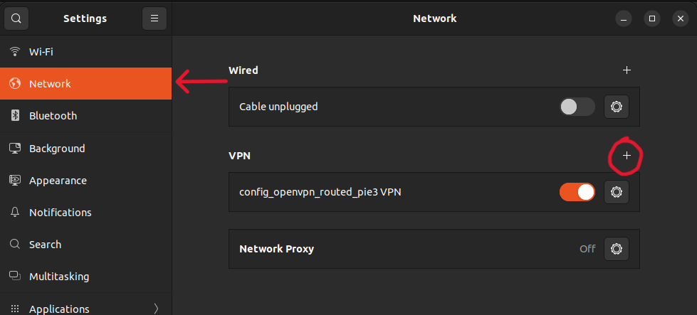
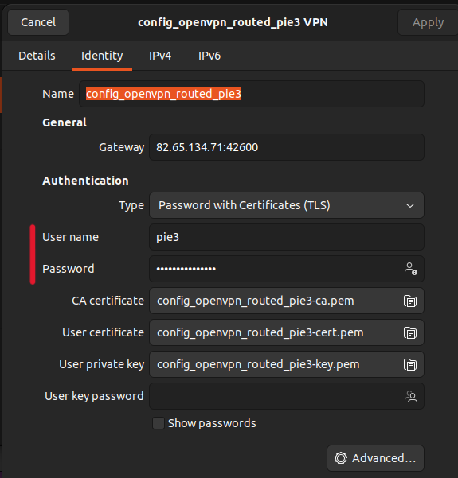
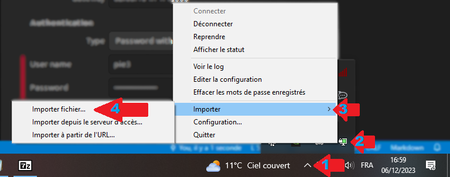
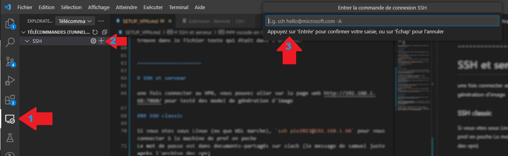

table utilisateur / VPN:

| User     | VPN  |
|----------|------|
| Nicolas  | Pie1 |
| Martin   | Pie2 |
| Valentin | Pie3 |
| Pierre   | Pie4 |
|          | Pie5 |
|          | Pie6 |

Avant de prendre un VPN, annoncé sur le messenger/slack/sur ce fichier qu'elle connection vous utilisez.


==================

# Linux (Ubuntu)

décompressez l'archive VpnPie.rar dans le channel #document-partagés de slack

```unrar x VpnPie.rar```

ensuite,  dans les paramètre d'internet, ajouté un vpn et selectionné l'option `importé depuis un fichier`



Selectioné le fichier `config_openvpn_routed_pie#.ovpn` où # est le numérot de votre vpn.

dans la configuration du vpn, en nom d'utilisatuer, mettez `pie#` et le mod de passe se trouve dans le fichier `VpnPieMdp.txt` dans l'archive.



===================

# Windows

### 1 installé openVPN

[lien vers la page de téléchargment](https://openvpn.net/community-downloads/)

N'allez pas juste sur google cherché OpenVPN, la version `-connect` qu'il propose par défaud ne fonctionne pas pour nous. 

### 2 décompressé l'archive des vpn

l'archive des fichier de configuration est disponible dans le channel `#documents-partagés` du slack avec le mot de passe.

si vous n'avez pas d'application pour ouvrire l'archive, j'utilise pour ma part 7Zip qui est gratuit.

Extrayez l'archive où vous voulez, vous allez avoir des fichier `X.ovpn` et un fichier texte avec les MdP.

### 3 lancé le vpn

Dans la barre des taches, en bas à droite de l'écran, faites un click droit sur `OpenVPN GUI` -> Importer -> Importer fichier...



Selectioné le fichier `config_openvpn_bridge_pie#.ovpn` où # est le numérot de votre vpn.

Le nom d'utilisateur est `pie#` (où # est le numérot de votre vpn) et le MdP se trouve dans le fichier texte qui était dans l'archive.


=====================

# SSH et serveur

une fois connecter au VPN, vous pouvez aller sur la page web http://192.168.1.68:7860/ pour testé des model de génération d'image

### SSH classic

Si vous etes sous Linux (ou que WSL marche), `ssh pie2023@192.168.1.66` pour vous connecter à la machine de prof en poche
Le mot de passe est dans documents-partagés sur slack (le message de samuel juste après l'archive des vpn)

### vscode en SSH

pour utilisé vscode sur la machine distante (et si le ssh ne marche pas),

dans VScode, installé l'extantion `Remote - SSH`. A gauche de la fenètre, dans l'onglet `explorateur distant`, faites nouveau distant (le + à droite de ssh) et tapé `ssh pie2023@192.168.1.66` dans le champ ssh présenté.



Le mot de passe est dans documents-partagés sur slack (le message de samuel juste après l'archive des vpn)

choisissez comme systeme Linux si il demande.

Vous pouvez ouvrire un dossier ou des fichier ou bien un terminal.
